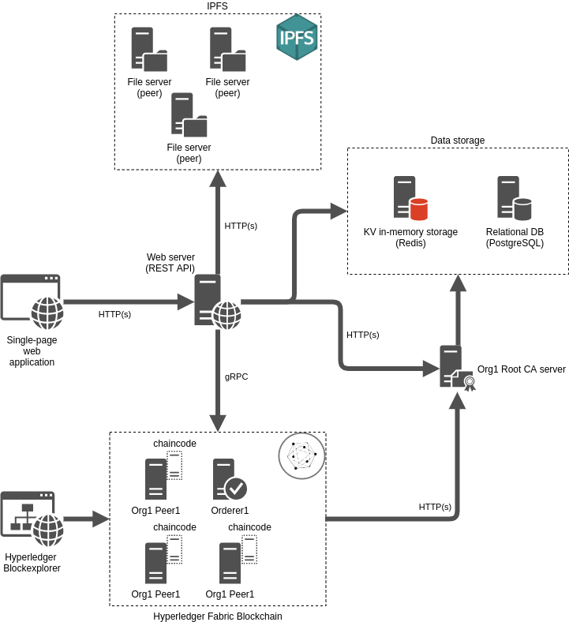

# Solution Architecture

Database Tier - the database level is used to manage users - storing logins, passwords, Fabric certificates and IPNS private keys.
This is done for the convenience of using the system through the API and eliminating the need for the user to install additional software for working with Fabric and IPFS.

Server Tier - REST API, business logic, interaction with services and the database.

Client Tier - this layer includes: additional logic for encrypting user passwords, as well as sending requests to the server.
The client uses the library generated by Swager which provides a set of methods for sending REST requests.

Permission service - for managing file and directory access rights it works on the Fabric private blockchain. This service has the following functionality:
  - The user can give rights to view and update directories and files to other users.
  - User can view file permissions.
  - The user can get a list of directories and files available to him with an indication of their owners.

Files service - provides distributed storage of user files and directories.
IPNS is a distributed registry for files and directories. The principle of IPNS is that users publish a fixed resource address,
which is stored in IPFS, signed with a key from a public-private key pair. Updating an entry in IPNS can only be done with the same key that was used to create the entry.
This system allows you to give a permanent address to the resource when it is updated, which is necessary because resources in IPFS are addressed by their hash (content ID, CID) and when the file is updated, its CID changes
